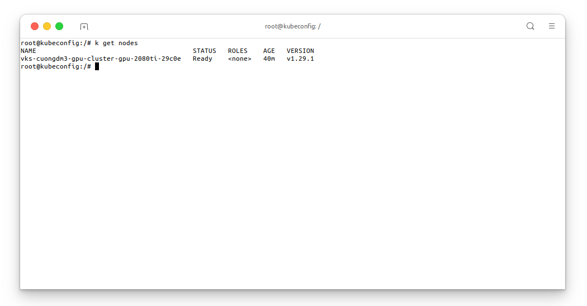
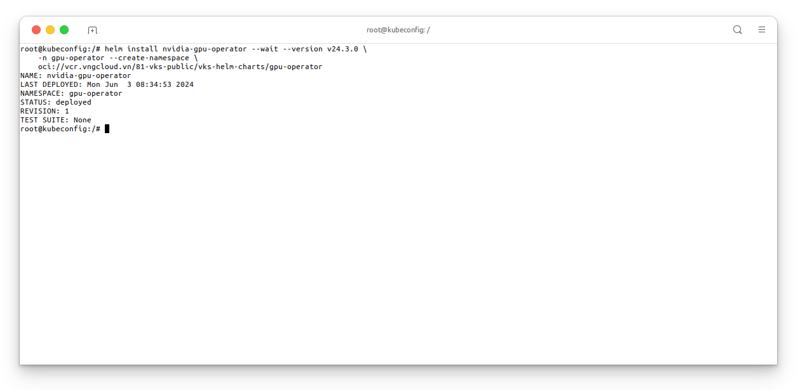
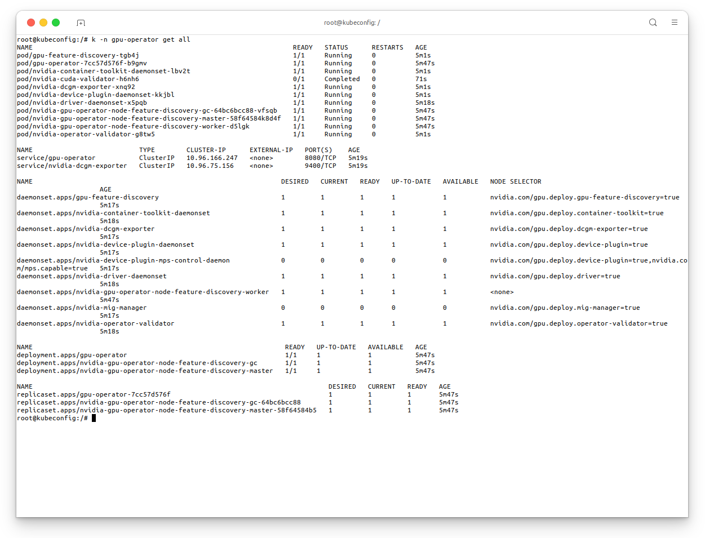
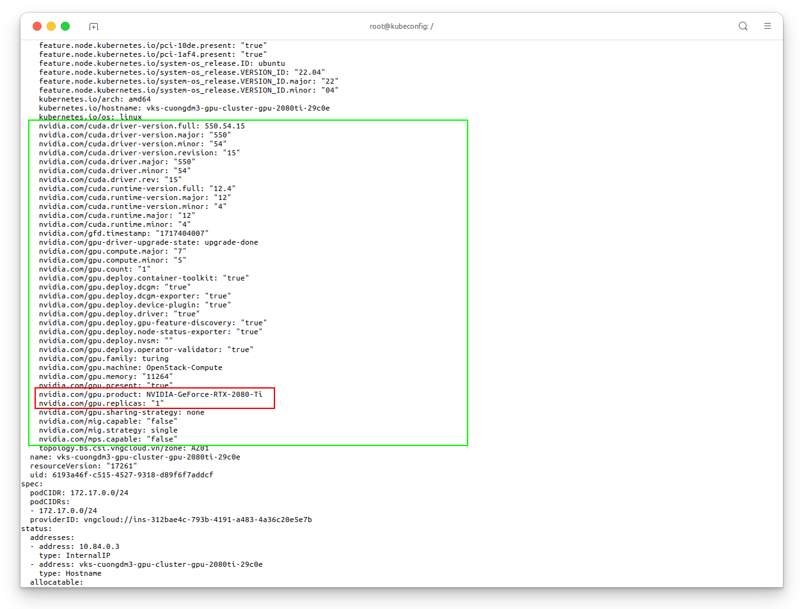
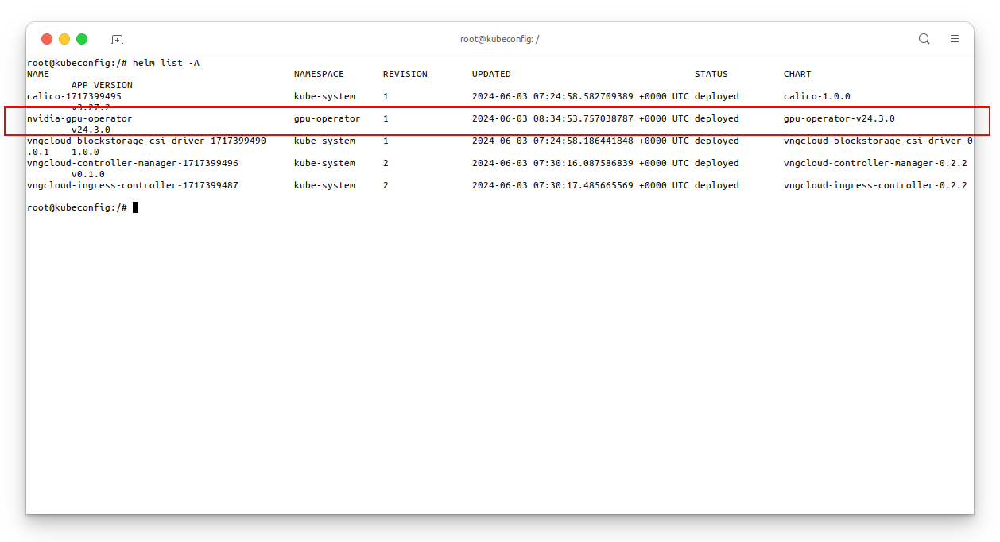
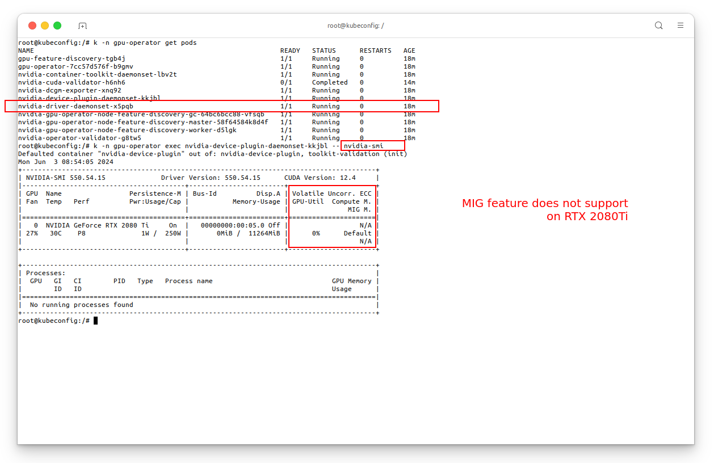
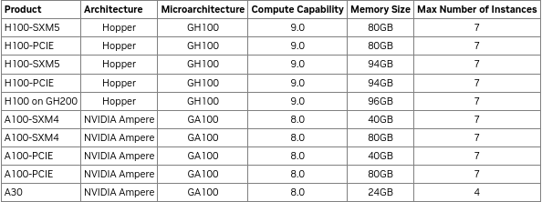
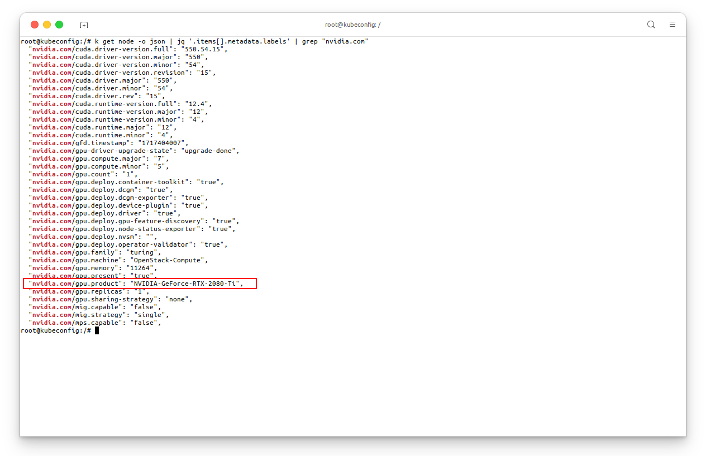
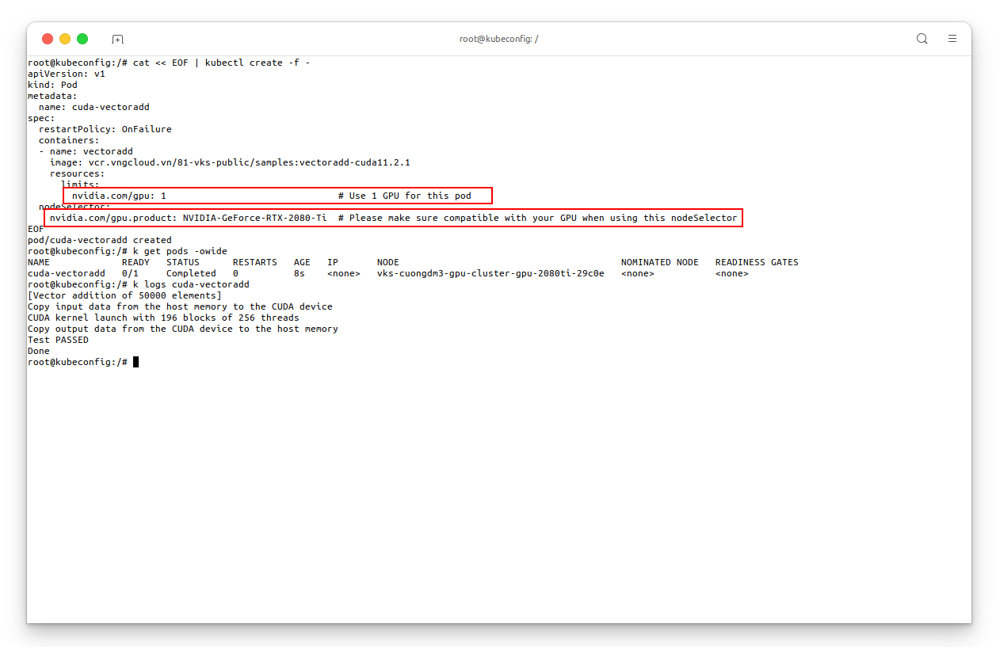

# Using Nvidia GPU with VKS clusters
- ***Author***: Cuong. Duong Manh
- ***Email***: cuongdm3@vng.com.vn
- ***Date***: 2024-06-03

<hr>

**Table of Contents**

- [1. Introduction](#1-introduction)
- [2. Install `gpu-operator` of Nvidia on VKS clusters](#2-install-gpu-operator-of-nvidia-on-vks-clusters)
- [3. Deploy a GPU workload on VKS clusters](#3-deploy-a-gpu-workload-on-vks-clusters)


## 1. Introduction
- In this document, I want to focus on how to use Nvidia GPU with VKS clusters, including of:
  - Install `gpu-operator` of Nvidia on VKS clusters.


## 2. Install `gpu-operator` of Nvidia on VKS clusters
- In this guideline, I deployed a VKS cluster with the following configuration:
  - Kubernetes version `v1.29.1`.
  - 1 node with **1 Nvidia GPU RTX 2080Ti**.
  - And with **4 CPU cores and 16GB of RAM**.

- Let's have a quick glance about my cluster using:
  ```bash
  kubectl get nodes -owide
  ```

<center>

  

</center>

- Install Nvidia `gpu-operator` using the below commands (Helm 3+ is required):
  ```bash
  helm install nvidia-gpu-operator --wait --version v24.3.0 \
      -n gpu-operator --create-namespace \
      oci://vcr.vngcloud.vn/81-vks-public/vks-helm-charts/gpu-operator
  ```
<center>

  

</center>

- Until this moment, if your all action is correct, your cluster is lovely with Nvidia GPU. You can check the status of Nvidia GPU by the following command:
  ```bash
  kubectl -n gpu-operator get all
  ```

<center>

  

</center>

- The `gpu-operator` will relabels some pair of key-value to the node, you can check it by the following command:
  ```bash
  kubectl get nodes <gpu-node> -oyaml
  ```

<center>

  

</center>

- Using `helm list repo -A` to get the status of Nvidia GPU:
  ```bash
  helm list repo -A
  ```

<center>

  

</center>

- Use can using `nvidia-smi` on the node which is integrated with Nvidia GPU. The `gpu-operator` use `DaemonSet` to deploy the `nvidia-driver` to the node. You can check the status of `DaemonSet` by the following command:
  ```bash
  kubectl -n gpu-operator exec nvidia-driver-daemonset-<random-string> -- nvidia-smi 
  ```

  <center>

    

  </center>

  > **Note**: 
  > - **Multi-Instance GPU** (aka ***MIG***) is a greate feature of Nvidia GPU using Ampere architecture. But in this guideline, my node is using RTX 2080Ti.
  > - This page lists entire the Nvidia products that support MIG feature [https://docs.nvidia.com/datacenter/tesla/mig-user-guide/index.html](https://docs.nvidia.com/datacenter/tesla/mig-user-guide/index.html) _(ref 2024-06-03)_.
  > <center>
  > 
  >    
  > 
  > </center>

## 3. Deploy a GPU workload on VKS clusters
### 3.1. Verify the Nvidia GPU - Running sample CUDA workloads
- Get the GPU profile:
  ```bash
  kubectl get node -o json | jq '.items[].metadata.labels' | grep "nvidia.com"
  ```
  <center>

    

  </center>

- Let’s run a simple CUDA sample, in this case vectorAdd by requesting a GPU resource as you would normally do in Kubernetes. In this case, Kubernetes will schedule the pod using a nodeSelector to direct the pod to be scheduled on the node.
  ```bash
  cat << EOF | kubectl create -f -
  apiVersion: v1
  kind: Pod
  metadata:
    name: cuda-vectoradd
  spec:
    restartPolicy: OnFailure
    containers:
    - name: vectoradd
      image: vcr.vngcloud.vn/81-vks-public/samples:vectoradd-cuda11.2.1
      resources:
        limits:
          nvidia.com/gpu: 1                               # Use 1 GPU for this pod
    nodeSelector:
      nvidia.com/gpu.product: NVIDIA-GeForce-RTX-2080-Ti  # Please make sure compatible with your GPU when using this nodeSelector
  EOF
  ```
  <center>

    
  
  </center>

### 3.2. Time slicing and GPU sharing
- The NVIDIA GPU Operator enables oversubscription of GPUs through a set of extended options for the NVIDIA Kubernetes Device Plugin. GPU time-slicing enables workloads that are scheduled on oversubscribed GPUs to interleave with one another.

- Update the node label:
  ```bash
  kubectl label node <node-name> nvidia.com/device-plugin.config=rtx-2080ti
  ```