# Using Nvidia GPU with VKS clusters
- ***Author***: Cuong. Duong Manh
- ***Email***: cuongdm3@vng.com.vn
- ***Date***: 2024-06-03

<hr>

**Table of Contents**

- [1. Introduction](#1-introduction)
- [2. Install `gpu-operator` of Nvidia on VKS clusters](#2-install-gpu-operator-of-nvidia-on-vks-clusters)
- [3. Deploy a GPU workload on VKS clusters](#3-deploy-a-gpu-workload-on-vks-clusters)
  - [3.1. Verify the Nvidia GPU - Running sample CUDA workloads](#31-verify-the-nvidia-gpu---running-sample-cuda-workloads)
  - [3.2. Time slicing and GPU sharing](#32-time-slicing-and-gpu-sharing)


## 1. Introduction
- In this document, I want to focus on how to use Nvidia GPU with VKS clusters, including of:
  - Install `gpu-operator` of Nvidia on VKS clusters.


## 2. Install `gpu-operator` of Nvidia on VKS clusters
- In this guideline, I deployed a VKS cluster with the following configuration:
  - Kubernetes version `v1.29.1`.
  - 1 node with **1 Nvidia GPU RTX 2080Ti**.
  - And with **4 CPU cores and 16GB of RAM**.

- Let's have a quick glance about my cluster using:
  ```bash
  kubectl get nodes -owide
  ```

<center>

  

</center>

- Install Nvidia `gpu-operator` using the below commands (Helm 3+ is required):
  ```bash
  helm install nvidia-gpu-operator --wait --version v24.3.0 \
      -n gpu-operator --create-namespace \
      oci://vcr.vngcloud.vn/81-vks-public/vks-helm-charts/gpu-operator
  ```
<center>

  

</center>

- Until this moment, if your all action is correct, your cluster is lovely with Nvidia GPU. You can check the status of Nvidia GPU by the following command:
  ```bash
  kubectl -n gpu-operator get all
  ```

<center>

  

</center>

- The `gpu-operator` will relabels some pair of key-value to the node, you can check it by the following command:
  ```bash
  kubectl get nodes <gpu-node> -oyaml
  ```

<center>

  

</center>

- Using `helm list repo -A` to get the status of Nvidia GPU:
  ```bash
  helm list repo -A
  ```

<center>

  

</center>

- Use can using `nvidia-smi` on the node which is integrated with Nvidia GPU. The `gpu-operator` use `DaemonSet` to deploy the `nvidia-driver` to the node. You can check the status of `DaemonSet` by the following command:
  ```bash
  kubectl -n gpu-operator exec nvidia-driver-daemonset-<random-string> -- nvidia-smi 
  ```

  <center>

    

  </center>

  > **Note**: 
  > - **Multi-Instance GPU** (aka ***MIG***) is a greate feature of Nvidia GPU using Ampere architecture. But in this guideline, my node is using RTX 2080Ti.
  > - This page lists entire the Nvidia products that support MIG feature [https://docs.nvidia.com/datacenter/tesla/mig-user-guide/index.html](https://docs.nvidia.com/datacenter/tesla/mig-user-guide/index.html) _(ref 2024-06-03)_.
  > <center>
  > 
  >    
  > 
  > </center>

## 3. Deploy a GPU workload on VKS clusters
### 3.1. Verify the Nvidia GPU - Running sample CUDA workloads
- Get the GPU profile:
  ```bash
  kubectl get node -o json | jq '.items[].metadata.labels' | grep "nvidia.com"
  ```
  <center>

    

  </center>

- Let’s run a simple CUDA sample, in this case vectorAdd by requesting a GPU resource as you would normally do in Kubernetes. In this case, Kubernetes will schedule the pod using a nodeSelector to direct the pod to be scheduled on the node.
  ```bash
  cat << EOF | kubectl create -f -
  apiVersion: v1
  kind: Pod
  metadata:
    name: cuda-vectoradd
  spec:
    restartPolicy: OnFailure
    containers:
    - name: vectoradd
      image: vcr.vngcloud.vn/81-vks-public/samples:vectoradd-cuda11.2.1
      resources:
        limits:
          nvidia.com/gpu: 1                               # Use 1 GPU for this pod
    nodeSelector:
      nvidia.com/gpu.product: NVIDIA-GeForce-RTX-2080-Ti  # Please make sure compatible with your GPU when using this nodeSelector
  EOF
  ```
  <center>

    
  
  </center>

### 3.2. Time slicing and GPU sharing
- The NVIDIA GPU Operator enables oversubscription of GPUs through a set of extended options for the NVIDIA Kubernetes Device Plugin. GPU time-slicing enables workloads that are scheduled on oversubscribed GPUs to interleave with one another.

- Update the node label:
  ```bash
  kubectl label node <node-name> nvidia.com/device-plugin.config=rtx-2080ti
  ```
  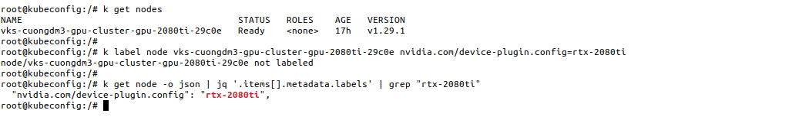


#### 3.2.1. Applying One Cluster-Wide Configuration
> **🚨 NOTE**:
> - Please remove all label `nvidia.com/device-plugin.config` from all nodes before applying this configuration. Otherwise, 2 pods `node-feature-discovery` and `nvidia-device-plugin-daemonset` will be in the `Pending` state.
> 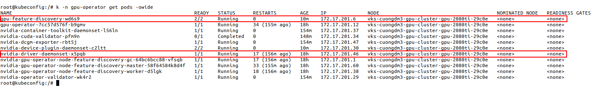

- Perform the following steps to configure **GPU time-slicing** if you **already installed** the GPU operator and want to **apply the same time-slicing configuration on all nodes** in the cluster.
- Create a file, such as [time-slicing-config-all.yaml](./manifest/time-slicing-config-all.yaml), with contents like the following example:
  ```yaml
  apiVersion: v1
  kind: ConfigMap
  metadata:
    name: time-slicing-config-all
  data:
    any: |-                          # Just for human-readable purpose
      version: v1
      flags:
        migStrategy: none            # Disable MIG, MUST be none in the case your GPU is not supported MIG
      sharing:
        timeSlicing:
          resources:
          - name: nvidia.com/gpu     # Only apply for the node with the node.status contains 'nvidia.com/gpu'
            replicas: 4              # Allow 4 pods to share the GPU
  ```

- Apply the configuration:
  ```bash
  kubectl -n gpu-operator create -f time-slicing-config-all.yaml
  ```
  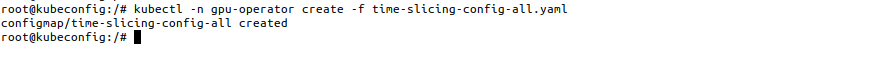

- Update the `ClusterPolicy` to use this time-slicing configuration:
  ```bash
  kubectl patch clusterpolicies.nvidia.com/cluster-policy \
    -n gpu-operator --type merge \
    -p '{"spec": {"devicePlugin": {"config": {"name": "time-slicing-config-all", "default": "any"}}}}'
  ```
  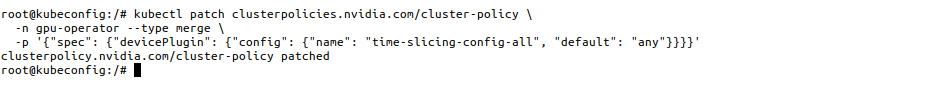

- Until this step, all the above stuff will make your cluster CAN share the GPU with 4 pods. You can check that GPU work well by running a new Deployment of cuda testing image, this is the example Deployment manifest:
  ```yaml
  # File: time-slicing-verification.yaml
  apiVersion: apps/v1
  kind: Deployment
  metadata:
    name: time-slicing-verification
    labels:
      app: time-slicing-verification
  spec:
    replicas: 5
    selector:
      matchLabels:
        app: time-slicing-verification
    template:
      metadata:
        labels:
          app: time-slicing-verification
      spec:
        tolerations:
          - key: nvidia.com/gpu                # Only apply for the node with the node.status contains 'nvidia.com/gpu'
            operator: Exists
            effect: NoSchedule
        hostPID: true
        containers:
          - name: cuda-sample-vector-add
            image: "vcr.vngcloud.vn/81-vks-public/cuda-sample:vectoradd-cuda11.7.1-ubuntu20.04"
            command: ["/bin/bash", "-c", "--"]
            args:
              - while true; do /cuda-samples/vectorAdd; done
            resources:
              limits:
                nvidia.com/gpu: 1              # Use 1 GPU for this pod
  ```
- This deployment will create 5 pods, each pod will run the `vectorAdd` CUDA sample in an infinite loop. The pods will be scheduled on the node with the GPU, and the GPU will be shared among the pods. But following the previous time slicing configuration, only 4 pods can run concurrently on the GPU so the 5th pod will be in the `Pending` state.
  ```bash
  kubectl apply -f time-slicing-verification.yaml
  ```
  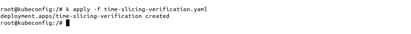

- You can check the status of the pods by running the following command:
  ```bash
  kubectl get pods -owide
  ```
  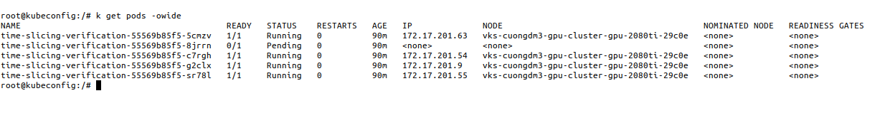

#### 3.2.2. Applying Multiple Node-Specific Configurations
- An alternative to applying one cluster-wide configuration is to specify **multiple time-slicing configurations** in the `ConfigMap` and to **apply labels** node-by-node to control which configuration is applied to which nodes.
- In this guideline, I add a new RTX-4090 into the cluster.
- This configuration should be greate if your cluster have multiple nodes with different GPU models. For example:
  - NodeGroup 1 includes the instance of GPU RTX 2080Ti.
  - NodeGroup 2 includes the instance of GPU RTX 4090.
- So this is my cluster after adding the new node to emulate the above scenario:
  ```bash
  kubectl get nodes -owide
  ```
  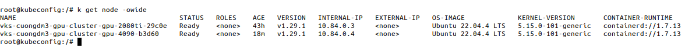

- So **first step**, I need to label for the GPU nodes in my cluster, this is a really **IMPORTANT** step.
  ```bash
  kubectl label node <node-name> nvidia.com/device-plugin.config=rtx-2080ti
  kubectl label node <node-name> nvidia.com/device-plugin.config=rtx-4090
  ```
  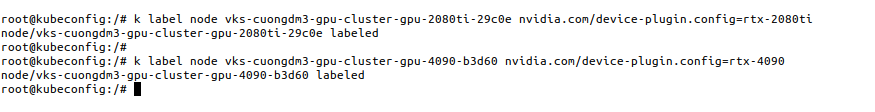

- The **second step**, I need to configure a `ConfigMap`, the purpose of this one is to define the time-slicing configuration for each GPU model. This is an example of the `ConfigMap`,file `time-slicing-config-fine.yaml`:
  ```yaml
  # File: time-slicing-config-fine.yaml
  apiVersion: v1
  kind: ConfigMap
  metadata:
    name: time-slicing-config-fine
  data:
    rtx-4090: |-                                  # Same the name with the name that you label the GPU node before
      version: v1
      flags:
        migStrategy: none                         # MIG strategy is not used, this field SHOULD depends on your GPU model
      sharing:
        timeSlicing:
          resources:
          - name: nvidia.com/gpu
            replicas: 10                          # Allow the node using this GPU to be shared by 10 pods
    rtx-2080ti: |-                                # Same the name with the name that you label the GPU node before
      version: v1
      flags:
        migStrategy: none                         # MIG strategy is not used, this field SHOULD depends on your GPU model
      sharing:
        timeSlicing:
          resources:
          - name: nvidia.com/gpu
            replicas: 5                           # Allow the node using this GPU to be shared by 5 pods
  ```

  ```bash
  kubectl create -n gpu-operator -f time-slicing-config-fine.yaml
  ```
  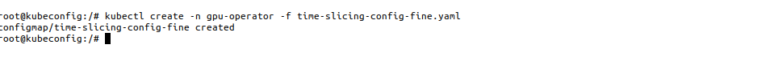

- And it also like the section [3.2.1](#321-applying-one-cluster-wide-configuration), the **third step** is to update the `ClusterPolicy` to use this time-slicing configuration, and then check the `ClusterPolicy` is updated successfully by the following command:
  ```bash
  kubectl patch clusterpolicies.nvidia.com/cluster-policy \
    -n gpu-operator --type merge \
    -p '{"spec": {"devicePlugin": {"config": {"name": "time-slicing-config-fine"}}}}'

  kubectl get clusterpolicy
  ```
  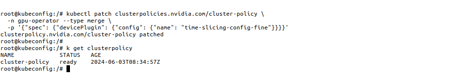
- And final step, apply the `Deployment` [time-slicing-verification.yaml](./manifest/time-slicing-verification.yaml) to verify the time-slicing configuration:
  ```bash
  kubectl apply -f time-slicing-verification.yaml
  kubectl get pods -owide
  ```
  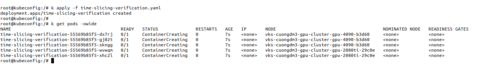